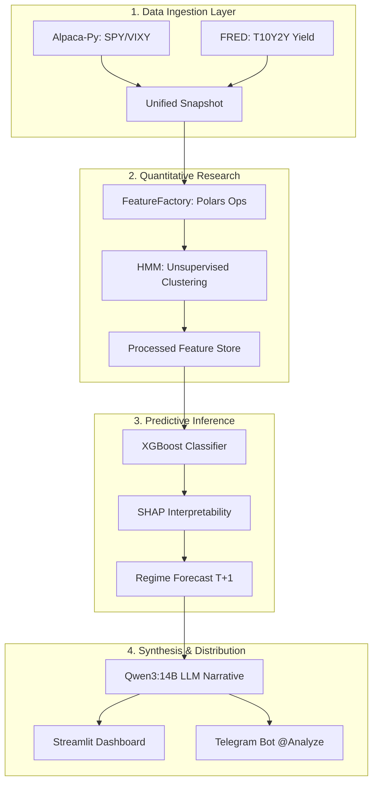

# RegimeDetector: Institutional-Grade Quant Pipeline

End-to-end market regime detection pipeline that combines macro data, technical indicators, HMM-based latent state discovery, XGBoost forecasting, and SHAP explanations to classify the next-day market regime as Bearish, Neutral, or Bullish.

## TL;DR
- Detects latent market states from live and macro data.
- Forecasts next-day regime probabilities using engineered features.
- Delivers interpretable outputs through a Streamlit dashboard and Telegram bot.
---

## System Architecture & Flow
The pipeline is designed with a **decoupled, modular architecture** to ensure high availability and low latency during live market hours.

## Technical Implementation

Unsupervised HMM (Hidden Markov Model): Used to identify latent market states (Volatility vs. Return clusters) without human labeling bias.

Supervised XGBoost Classifier: Forecasts the probability of the next day's regime based on lagged technical indicators and macro yield spreads.

Feature Engineering: High-performance processing using Polars, implementing:

VPA (Volume Price Analysis): Detecting institutional accumulation/distribution.

Volatility Scaling: 5-day realized volatility normalized against macro regimes.

Momentum Deceleration: Multi-timeframe RSI and momentum divergence.

## LLM Strategy Synthesis

The system utilizes a local Qwen3:14B model via Ollama to perform "Signal Synthesis." It translates raw SHAP values and quant metrics into actionable institutional briefings, reducing the cognitive load for the trader.

## Interactive Telegram Bot

The bot acts as a remote command center. Users can trigger the full pipeline via /analyze.

Asynchronous Execution: Uses asyncio.to_thread to prevent blocking the bot while the engine crunches data.

HTML Formatting: Robust reporting that escapes technical characters to ensure clean delivery.

## Institutional Dashboard

A real-time Streamlit interface providing:

Regime Trend: 30-day historical regime tracking.

SHAP Impact: Visualizing which features (e.g., Yield Spread vs. RSI) are currently driving the model's decision.

Confidence Gauges: Real-time probability distributions for Bull/Bear/Neutral states.

## Intellectual Property Note
Note: The specific mathematical weights, HMM transition matrices, and hyperparameter configurations are excluded from this public release to protect proprietary trading logic.

